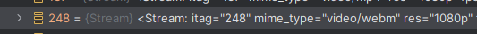
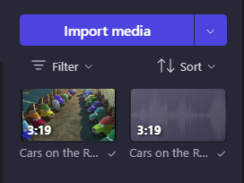

# Python: Download High Quality YouTube Videos

This guide will explain how to download the highest quality video/audio files from YouTube using a Python library.

<!-- more -->

!!! note
    You will also have to use a movie maker software to combine the video/audio files.

Firstly, you will need Python installed. You will also need the [GitHub repo](https://github.com/gary-kaufman/garys-pytube-video-downloader) related to this project. Clone this repo locally.

When opening the project in your favorite IDE/text editor (I used PyCharm) firstly, pip install the needed dependencies:

```commandline
pip install pytubefix
```

Now work your way to the `main.py` file to where you will replace the url with your selected video url:

```python
url = "https://youtu.be/2jVBWyih-RU?si=Gne7gjpW_XlFIu5G"
```

Now add a breakpoint on the following line:

```python
yt.streams.filter()
```

Now using an IDE, debug the programming, stopping on the above breakpoint. This will allow you to inspect the `yt` object.

You are looking for the `itag_index` array that is nested in `yt` as `yt.streams.itag_index`.


I chose the following video and audio file because they were of the highest quality. I chose the `webm` video format because it worked best with Clipchamp.




Now change the line of code with your selected `itag` and run the script, then do it again for the other file.

```python
    stream = yt.streams.get_by_itag(248)
```
After this, head into Clipchamp and import both files in the project.



Then place them on the timeline together!


Finally, use the `Export` button in the upper-right hand corner to export your video to your computer!


Thanks for taking a chance to read this guide. I hope you found it helpful!
