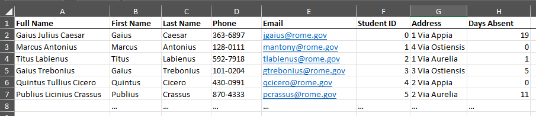
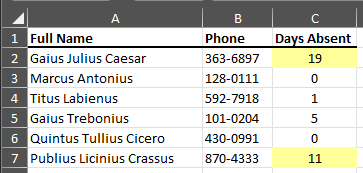

# openpyxl: My Favorite Features

*openpyxl* is a Python library for reading and writing Excel files.
Please check our their full [documentation](https://openpyxl.readthedocs.io/en/stable/#) for more information.
I often use it to format rows or extract data from one Excel file to another. 
We'll check out various tips with my example below.

<!-- more -->

The code from this guide is here on GitHub: [absentee-highlighter](https://github.com/gary-kaufman/absentee-highlighter).

For today's example we'll have an input file that represents a large membership document.
Our goal will be to find out who hasn't been to class in a while, and in a smaller output file, create a 'roll' for class,
highlighting students that have excessive absences. Let's begin.

---

Below is a screenshot of the main membership Excel file called `full-membership.xlsx`:


The script will extract the **Full Name**, **Phone**, and **Days Absent** from each row and use them in our output file.
If someone has excessive absent days, it will highlight that person's row to alert the teacher.

Starting off, I read in the input Excel file with `load_workbook` from *openpyxl*. This function takes in the filename as a string, and for us it is previously
declared as `input_filename`. Select the active worksheet from this workbook, then declare the `row_count`. This will be used to iterate through our current file and output file and the value is `2`, so that it will skip the header row.

```python
# Read in input file
    full_membership_workbook = load_workbook(input_filename)
    full_membership_worksheet = full_membership_workbook.active
    row_count = 2  # Skip first row, which contains headers
```

Next it prepares the output file. To create a new Excel file, use: `openpyxl.Workbook()`

```python
    # Set up destination file
    absentee_highlighted_workbook = openpyxl.Workbook()
    absentee_highlighted_worksheet = absentee_highlighted_workbook.active
```

To set up the header rows, I used the following values and iterated through the first three cells of the output file.

```python
    # Set up header rows on destination file
    columns = ["A", "B", "C"]
    column_widths = [25, 10, 12]
    header_names = ["Full Name", "Phone", "Days Absent"]

    for index in range(3):
        cell = absentee_highlighted_worksheet.cell(1, index + 1)

        cell.value = header_names[index]
        cell.border = Border(bottom=Side(style="medium"))
        cell.font = Font(bold=True)

        absentee_highlighted_worksheet.column_dimensions[columns[index]].width = column_widths[index]
```

To select a single cell, I used `.cell` on the worksheet, which takes two parameters, the row index, and column index. The row was always `1`, to select that header row,
and the column indicator is `index + 1` since the python range starts at `0`.

```python
cell = absentee_highlighted_worksheet.cell(1, index + 1)
```

!!! note
    Notice that the row and column index for *openpyxl* starts at `1`.

`cell.value` allows me to insert text into the cell, `cell.border` and `cell.font` allow me to change the border and font attributes of the cell. Specifics about these attributes can be found [here](https://openpyxl.readthedocs.io/en/stable/api/openpyxl.styles.borders.html) for border and [here](https://openpyxl.readthedocs.io/en/stable/api/openpyxl.styles.fonts.html) for font.

```python
cell.value = header_names[index]
cell.border = Border(bottom=Side(style="medium"))
cell.font = Font(bold=True)
```

To get the column width just right, I used `column_dimensions[index].width` attribute of the worksheet with my numeric values for the size. The index is the letter applied to the column. I came across this in the following [guide](https://www.geeksforgeeks.org/python-adjusting-rows-and-columns-of-an-excel-file-using-openpyxl-module/#).

```python
absentee_highlighted_worksheet.column_dimensions[columns[index]].width = column_widths[index]
```

Now the script iterates through the input file, and copies to the output file, and highlights on excessive absent days.

```python
# Iterate through membership worksheet and add rows to destination worksheet
    while True:
        # Get values from columns
        full_name = full_membership_worksheet.cell(row_count, 1).value
        phone = full_membership_worksheet.cell(row_count, 4).value
        days_absent = full_membership_worksheet.cell(row_count, 8).value

        # Check End of File
        if full_name is None:
            break

        # Copy values into highlighted worksheet
        absentee_highlighted_worksheet.cell(row_count, 1).value = full_name
        absentee_highlighted_worksheet.cell(row_count, 2).value = phone
        absentee_highlighted_worksheet.cell(row_count, 3).value = days_absent
        absentee_highlighted_worksheet.cell(row_count, 3).alignment = Alignment(horizontal="center")

        # If `days_absent` is excessive, highlight the cell
        if days_absent > 10:
            absentee_highlighted_worksheet.cell(row_count, 3).fill = PatternFill("solid", fgColor="00FFFF99")

        row_count += 1
```

First, I gather the values from the input file for readability. Since we are in a while loop, we first check if we have an empty `full_name`, signifying that we are at the end of file. If so, we break out of the while loop.

```python
# Get values from columns
        full_name = full_membership_worksheet.cell(row_count, 1).value
        phone = full_membership_worksheet.cell(row_count, 4).value
        days_absent = full_membership_worksheet.cell(row_count, 8).value

        # Check End of File
        if full_name is None:
            break
```

Next we copy the values into the output worksheet, using it's cell's `value` attributes. I also used the `alignment` attribute to horizontally center the Days Absent integer. This is described fully [here](https://openpyxl.readthedocs.io/en/latest/api/openpyxl.styles.alignment.html).

```python
# Copy values into highlighted worksheet
        absentee_highlighted_worksheet.cell(row_count, 1).value = full_name
        absentee_highlighted_worksheet.cell(row_count, 2).value = phone
        absentee_highlighted_worksheet.cell(row_count, 3).value = days_absent
        absentee_highlighted_worksheet.cell(row_count, 3).alignment = Alignment(horizontal="center")
```

Now the script uses a simple if statement to check if the `days_absent` are more than 10. If so, it uses a cells `fill` attribute to highlight the cell. [Here](https://openpyxl.readthedocs.io/en/stable/api/openpyxl.styles.fills.html) is further information from *openpyxl* regarding this.

```python
        # If `days_absent` is excessive, highlight the cell
        if days_absent > 10:
            absentee_highlighted_worksheet.cell(row_count, 3).fill = PatternFill("solid", fgColor="00FFFF99")
```

Finally I used the `save` function on the workbook to finalize the output file! It requires the filename as a parameter as a string. Be sure to end the string with `.xlsx` to make sure it works as an Excel file.

```python
# Save file!
    absentee_highlighted_workbook.save(filename="excessive-absentees-highlighted-" + date.today().strftime("%m%d%y") + ".xlsx")
```

And below is the output! Thank you for reading!


