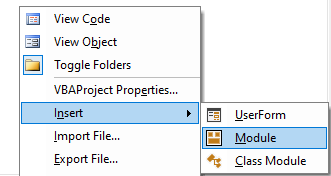
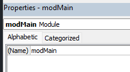
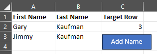
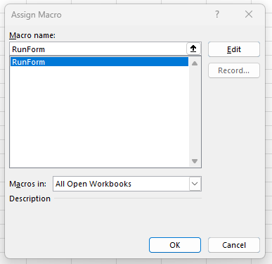

# VBA: Open UserForm With Button In Excel

This guide will quickly explain how you can create a button in your Excel file that can open up a UserForm.

<!-- more -->

First you will need to create a new module in the VBA editor by right clicking the project window and selecting Insert > Module.  


Using the Properties window, rename the module as `modMain`.  


Inside the code window for the module, add the following replacing `UserForm1` with whatever the name of your UserForm is:

```text
Sub RunForm()
UserForm1.Show
End Sub
```

Next, return to your Excel sheet, go to the Insert tab, and add a shape with whatever text you prefer.  


Right-click the shape you created and select `Assign Macro`. From the window that pops up, select the `RunForm` macro that we just created.  


You are all set! Now click the button and watch that magical UserForm appear! :sunglasses:

**Don't forget to save the file as `.xlsm` to enable macros so that your UserForm will run!**
