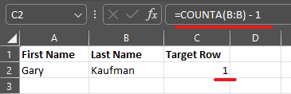
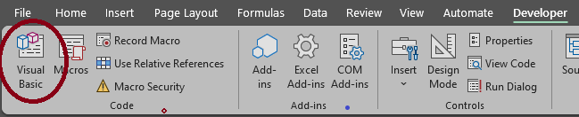
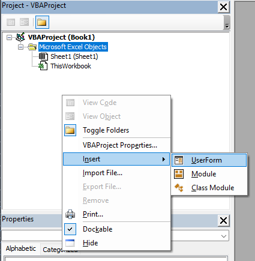
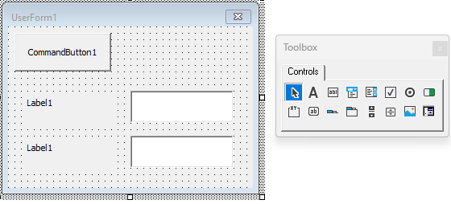
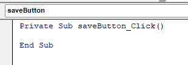
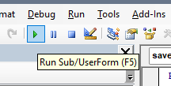
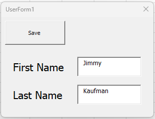
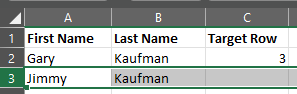

# VBA: UserForm to a New Row

This guide will explain how to create a UserForm in VBA that takes its results directly to a new row in the Excel sheet.

<!-- more -->

With a row or two of data, add a header to a new column called `Target Row` and in the first cell use the `COUNTA`[^a^]("The `COUNTA` formula will count all rows with data in them.") formula on one of the
data columns:

```text
=COUNTA(B:B)
```



First open VBA editor by going to the Developer Tab and selecting Visual Basic. [^1]
  

Right click in the Project window and select: Insert > UserForm.


Use the toolbox to create a **Label** and **TextBox** for each field and a **CommandButton**.


Click each item and edit them accordingly with the Properties window that opens below the Project window.

- Label: Edit the `Caption` property to change the text in the label. [^b^]("This is also a great opportunity to change the `Font` property to your liking.")
- TextBox: Each TextBox must have a unique `Name` property to be referenced later.
- CommandButton: Edit the `Name` and `Caption` property to be referenced later.

Double click your CommandButton [^2] and it will open up the code editor.



Inside the newly created `saveButton_Click()` function [^3], add the following code. [^4]

```text
Private Sub saveButton_Click()

Dim TargetRow As Integer
TargetRow = Sheet1.Range("C2")

Sheet1.Range("A1").Offset(TargetRow, 0).Value = firstNameInput
Sheet1.Range("A1").Offset(TargetRow, 1).Value = lastNameInput

Unload Me

End Sub
```

Finally, click the green "Play" button in the VBA editor toolbar to run this UserForm to test it out.
  
  
  

I hope this was a quick and helpful guide! :sunglasses:

One of my main resources for this guide was the following [YouTube playlist](https://www.youtube.com/playlist?list=PLpOAvcoMay5T5N02WwPbOvop4MBCw_JHE).

[^1]: You may need to enable the `Developer` tab by customizing your ribbon.
[^2]: Double clicking a CommandButton will open up the Click event code, so this is what your code will do when you click it in Excel.
[^3]: This is not actually a function but a [Sub](https://learn.microsoft.com/en-us/office/vba/language/reference/user-interface-help/sub-statement) in VBA. It doesn't return anything.
[^4]:
    So essentially this code adds the `firstNameInput` and `lastNameInput` to their respective cells based on the TargetRow that is set on the sheet. The statement selects the Sheet ("Sheet1"), then the Range ("A1" being the very first cell), then we use Offset move down to the TargetRow and use the correct number that corresponds with the column. Finally, Value is how we tell VBA to insert our input into this cell.
